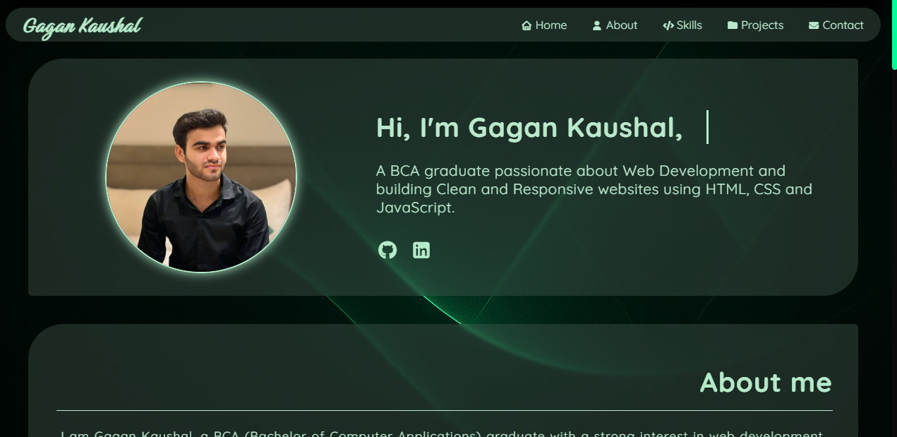
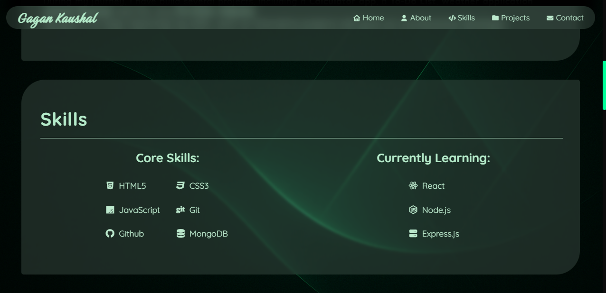
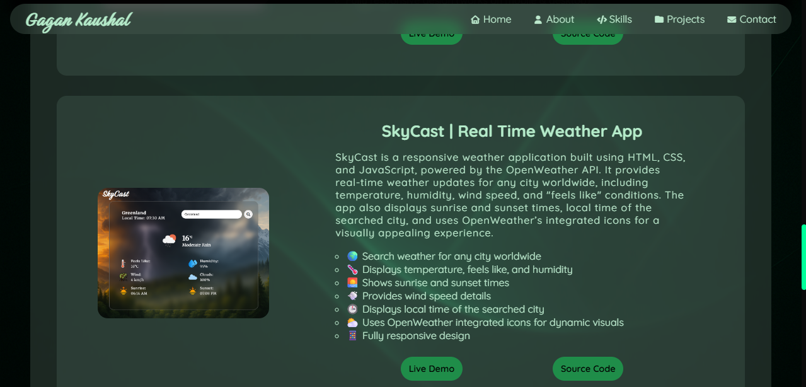

# 🌐 Portfolio Website – Gagan Kaushal

A personal portfolio website built with **HTML, CSS, and JavaScript**.  
It showcases my **skills, projects, and contact information** in a clean, responsive, and modern design.  

🔗 **Live Demo:** [https://Gagankaushal143.github.io/portfolio-website](https://Gagankaushal143.github.io/portfolio-website)  

---

## ✨ Features
- 🎨 Modern and responsive UI  
- 📱 Mobile-friendly navigation with hamburger menu  
- 💻 Animated hero section with typewriter effect  
- 📂 Projects section with live demo + source code links  
- 📧 Functional contact form using **EmailJS**  
- 🌙 Glassmorphism effects & smooth hover animations  

---

## 📸 Screenshots  

### Home Page  
  

### Skills Section  
  

### Projects Section  
  

---

## 🛠️ Tech Stack
- **HTML5**  
- **CSS3** (Flexbox, Grid, Animations)  
- **JavaScript (ES6)**  
- **EmailJS** (contact form integration)  
- **Font Awesome** (icons)  

---

## 🚀 Getting Started

Follow these steps to run the project locally:

**1. Clone this repository**
```bash
git clone https://github.com/Gagankaushal143/portfolio-website.git
```

**2. Navigate into the project folder**		
```bash
cd portfolio-website
```

**3. Open in your browser**
Simply open index.html in your preferred browser.


## 📬 Contact

👨‍💻 Gagan Kaushal
* **GitHub:** https://github.com/Gagankaushal143
* **LinkedIn:** https://www.linkedin.com/in/gagankaushal143/
* **Email:** gagankaushal143@gmail.com
